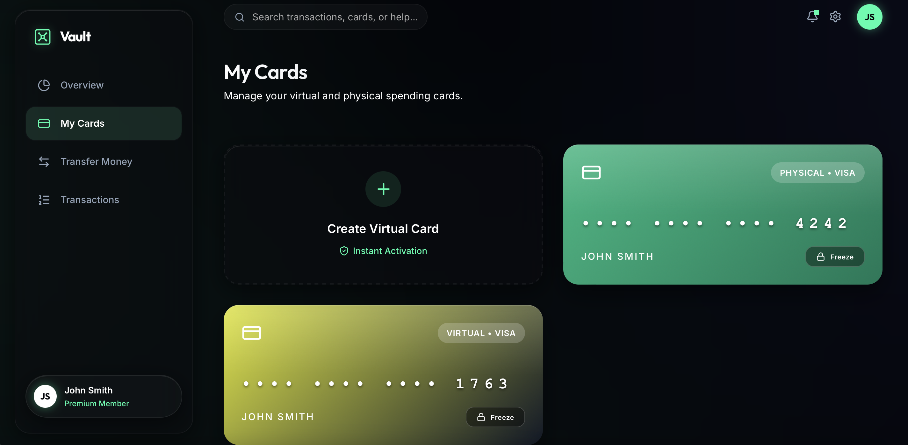
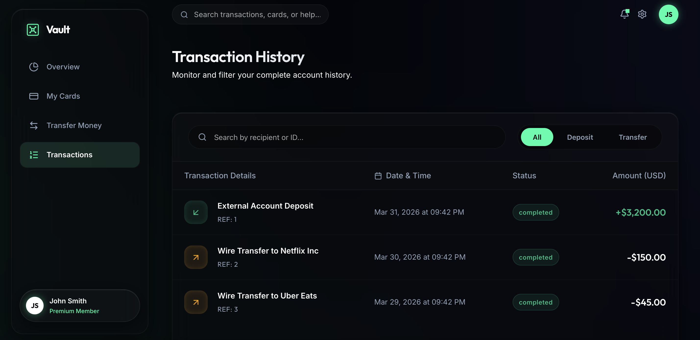
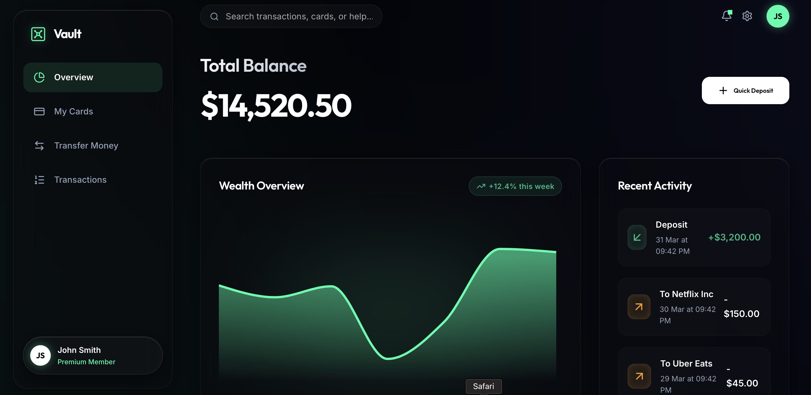

<div align="center">
  
  <h1 align="center">Vault NeoBank</h1>
  <p align="center">
    <strong>A 2026-level Premium FinTech UI/UX Showcase</strong>
  </p>
  <p align="center">
    Built with React, Vite, Framer Motion, and pure Vanilla CSS.
  </p>
  
  <div>
    
    
    
    
  </div>
</div>

<br />

<p align="center">
  
</p>

## 🖼️ Gallery Preview

<table>
  <tr>
    <td width="50%"></td>
    <td width="50%"></td>
  </tr>
</table>

## ✨ About The Project

Vault NeoBank is an open-source technical demonstration designed to showcase the absolute bleeding-edge of modern web aesthetics and React capabilities without relying on heavy UI frameworks (like Material-UI or Tailwind). 

Every component is meticulously crafted with **custom CSS**, leveraging advanced multi-layered glassmorphism, animated mesh gradients, and physically accurate 3D transitions.

### 🌟 Key Features

- **2026 Design Language**: Deep dark themes mixed with neon emerald glows and a custom 20-second animated CSS mesh background.
- **Hardware-Accelerated Animations**: Features buttery-smooth layout transitions and stagger-entrances powered by `framer-motion`.
- **Quantum-Like UX Feedback**: A global Toast Notification Context dynamically responding to state variations like virtual card generation and money transfers.
- **Advanced Context Management**: All user balances, transactions, and card settings are perfectly synchronized using React Context APIs and `useMemo` optimizations.
- **100% Strict TypeScript**: Clean, error-free types bridging `lucide-react` icons and heavily customized `recharts` graphs.

## 🚀 Getting Started

To get a local copy up and running, follow these simple conceptual steps.

### Prerequisites

Ensure you have the latest stable version of [Node.js](https://nodejs.org/) installed.

### Installation

1. Clone the repository
   ```sh
   git clone https://github.com/looooofmmmiii/Vault-bank-example.git
   ```
2. Navigate to the directory
   ```sh
   cd Vault-bank-example
   ```
3. Install dependencies
   ```sh
   npm install
   ```
4. Start the Vite development server
   ```sh
   npm run dev
   ```

## 🛠 Tech Stack

- **Framework**: `React 18` + `Vite`
- **Language**: `TypeScript`
- **Styling**: `Vanilla CSS` (Custom Properties, Keyframes, Backdrops)
- **Icons**: `Lucide React`
- **Animations**: `Framer Motion`
- **Data Viz**: `Recharts`

## 📄 License

Distributed under the MIT License. See `LICENSE` for more information.

---
<div align="center">
  <sub>Built with ❤️ as a React capability showcase.</sub>
</div>
